# 一、项目的的初始化

## 1 npm 初始化 

`npm init -y`

生成`package.json`文件

- 记录项目的依赖

## 2 git初始化

`git init`

生成`git`隐藏文件夹，git的本地仓库

## 3 创建Readme

项目指引

# 二、搭建项目

## 1 安装Koa框架

`npm i koa`

## 2 编写最基本的app

```js
// 导入Koa类
const Koa = require('koa');

// 实例化一个对象
const app = new Koa();

// 使用中间件
app.use((ctx, next) => {
  ctx.body = 'Hello Koa from main.js';
});

// 监听3000端口，对端口的所有http请求做出对应的回调响应
app.listen(3000, () => {
  console.log('server is running on http://localhost:3000');
});
```

## 3 测试

在终端，输入`node src/main.js` 开启服务

# 三、优化

## 1 起服务的优化

- 使用node起服务，每次修改后，需要重启服务，为了做到保存时，免于手动重启，将node 改为 nodemon，由nodemon来监听文件的改变，自动重启服务

- `npm i nodemon` 只是装了package，需要配置对应的脚本来使用

  ```js
  // 在packa.json的scripts下，配置脚本   
  "dev": "nodemon ./src/main.js",
      
  // 在控制台使用npm run dev 就起服务了
  ```

  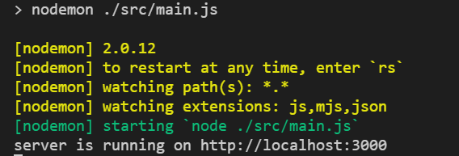

- **工具优化更新**：
  
  - 由于nodemon只是开发时需要用到，所以不需要把它放到dependencies中
  - 卸载依赖：`npn un xxx`
  - 在安装的时候，使用`npm i xxx -D `将依赖安装到dev开发环境中
  - 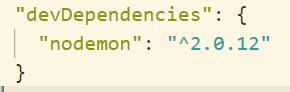

## 2 读取配置文件

- 安装 `npm i dotenv`

```js
npm i dotenv
```

- 根目录下创建`.env`文件，里面是环境配置的信息

  ```js
  APP_PORT = 3000
  ```

  

- 在`src`目录下创建不同的配置文件：主要是为了区别开来

  - config.default.js是默认的，生产环境
  - config.dev.js是开发环境的

## 3 导入dotenv，导出配置信息对象

- 在`config.default.js`中导入dotenv

  ```js
  // 导入
  const dotenv = require("dotenv");
  
  // 启动配置（官方默认）
  dotenv.config();
  
  // 获取.env的配置信息
  console.log(process.env.APP_PORT);
  
  // process.env是官方默认的配置信息对象，读取的就是.env的内容
  
  // 再将配置信息对象导出
  module.exports = process.env;
  ```

 ## 4 main.js文件中的引用

- 上文已经将配置信息对象导出，那么就在这里引用

  ```js
  // 引用
  const {APP_PORT} = require("./config/config.default.js");
  
  // 在监听端口时，可以使用 配置的端口信息，来监听不同的端口
  app.listen(APP_PORT,()=>{
      console.log(`running on http://localhost:${APP_PORT}`)
  })
  ```

  

# 四、路由

路由：根据不同的URL，调用对应的处理函数

## 1 安装路由中间件

通过命令`npm i koa-router`

步骤：

- 导入
- 实例化对象
- 编写路由
- 注册中间件

```js
// 导入路由
const Router = require('koa-router');
// 实例化路由对象
const indexRouter = new Router();
const userRouter = new Router();
// 编写路由
indexRouter.get('/', (ctx, next) => {
  ctx.body = 'This is router from index';
});
userRouter.get('/users', (ctx, next) => {
  ctx.body = 'This is router from users';
});
// 注册中间件，中间件必须是一个函数，所以调用的是koa-router的routes()函数
app.use(indexRouter.routes());
app.use(userRouter.routes());
```

## 2 重构路由

如果将所有的路由处理都写在main文件中，且每次都要

- 实例化
- 编写路由
- 注册

会让main显得特别的拖沓

所以将route模块独立出来，解耦

- 在src目录下创建一个文件夹router用于处理所有的路由
- 将所有的路由细分，如：处理/users/的路由，定义为：user.route.js

```js
// 将main中的路由部分转移到这里
// 导入路由中间件
const Router = require('koa-router');
// 实例化
// prefix参数是默认拼接参数，即：prefix+处理函数中的路径，才是最终的路由
const userRouter = new Router({ prefix: '/users' });

// 处理Get，最终实际获得：prefix+路径 = /users/
// 第一个参数是路径，第二个参数是回调处理函数
userRouter.get('/', (ctx, next) => {
  ctx.body = 'hello users';
});

// 导出userRouter
module.exports = userRouter;

-----------------------------------------------------------------
// main中的调用
// 导入路由文件
const userRouter = require('./router/user.route');

// 注册路由中间件
app.use(userRouter.routes())
```

# 五、项目目录结构优化

## 1、将http服务和app业务拆分

创建`src/app/index`目录

app目录下创建index.js文件，用作项目业务相关代码目录

```js
// index.js
// 导入
// Koa
const Koa = require('koa');
// 路由
const userRouter = require('../router/user.route');

// 实例化
// Koa的实例
const app = new Koa();
// 注册中间件，路由中间件的实例
app.use(userRouter.routes());

// 导出
// 给main.js中使用
module.exports = app;
```

## 2、改写main.js 入口文件

```js
// 导入
// 导入index中实例化的Koa
const app = require('./app/index');
// 导入config文件
const { APP_PORT } = require('./config/config.default');

app.listen(APP_PORT, () => {
  console.log(`server is running on http://localhost:${APP_PORT}`);
  //   console.log(`server is running on http://localhost:/3000`);
});
```

## 3、路由业务的抽离

将路由中的回调处理函数抽离，集成在`controller`目录，在router中调用时，采用结构赋值的方式，使用某个模块下的某个界面的路由

- 针对用户的路由处理：`user.controller.js`

```js
// user.controller.js文件
class userController {
  async register(ctx, next) {
    ctx.body = '用户注册成功';
  }
}

// 导出
// 不直接导出这个类，而是导出这个类实例化出的对象
// 导出给user.route.js使用
module.exports = new userController();

------------------------------------------------------------------
// 路由模块的导入和使用
// 新版：通过controller下的对应处理文件来触发回调
// require的是controller中实例化出来的一个对象，我们要使用的是对象中的一个方法，所以进行解构
const { register } = require('../controller/user.controller');

// 根据接口文档，使用正确的http方式：(get/post...)
userRouter.post('/register', register);


```

## 4、postman的使用

1、创建一个项目文件夹

`商城项目`

2、创建模块文件夹

`用户模块`

3、接口文件

`用户注册接口`、`用户登录接口`

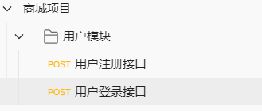

4、创建环境

开发环境：dev_env
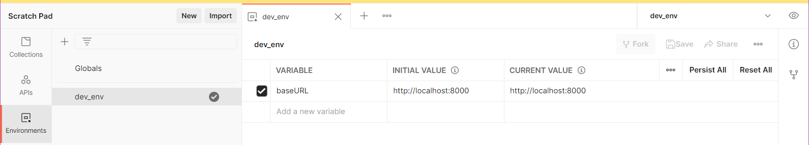

5、在接口文件中选择正确的环境，填写对应的URL

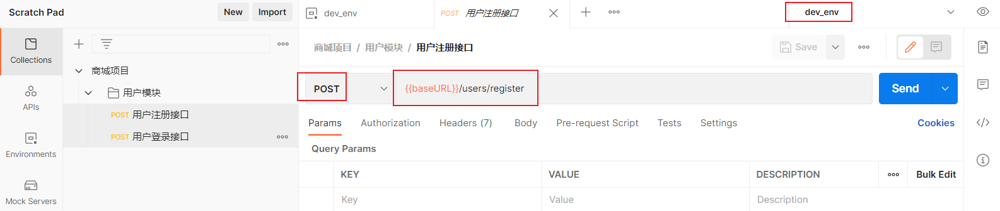

6、接口测试：点击send，看返回的结果

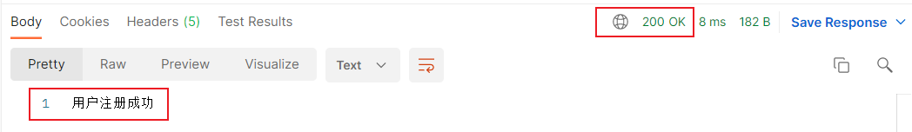


# 六、解析body

1、安装koa-body中间件

`npm i koa-body`

2、注意事项：解析body，必须要在router之前，否则不生效

3、在postman配置post的数据
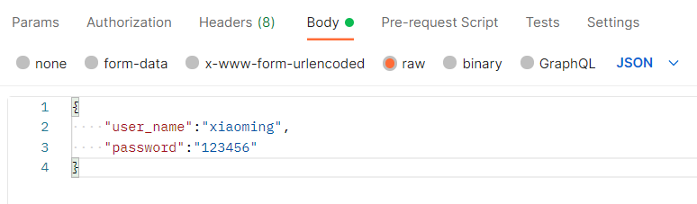

4、去到路由处理文件controller.js中，在对应的接口下设置查看post的数据

```js
async register(ctx, next) {
    // 控制台看一下请求体
    console.log(ctx.request.body); // 使用post方法时，在postman上配置request内容，可以在控制台打印出来
    // 如果客户端也要查看请求体的内容，就赋值给ctx.body，客户端可以拿到
    ctx.body = ctx.request.body;
  }
```


5、在postman点击send，可以在控制台获取到的post数据

```js
console.log(ctx.request.body);
```

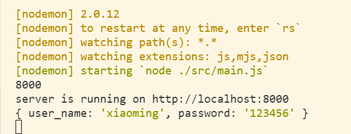

**主要步骤解释：**

- 获取数据
- 操作数据库
- 返回结果

## 2 注册中间件

改写app/index.js

```js
// 请求体内容解析，这个中间件的导入和注册，必须在路由的内容之前
const KoaBody = require('koa-body');

// koa-body中间件的注册，必须在路由中间件之前
app.use(KoaBody());
```


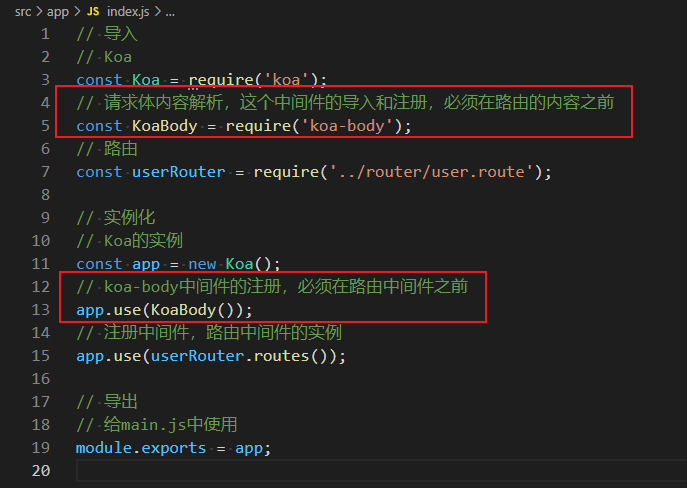

## 3 解析请求数据

改写user.controller.js：拿数据，操作数据库，返回结果

```js
// 导入数据库操作，因为这里的数据库操作是异步的，所以拿到return回来的结果是一个promise，所以要使用这个方法时，要用await
const { createUser } = require('../service/user.service');
class userController {
  async register(ctx, next) {
    // 1、获取数据
    // 控制台看一下请求体
    // console.log(ctx.request.body); // 使用post方法时，在postman上配置request内容，可以在控制台打印出来
    // 如果客户端也要查看请求体的内容，就赋值给ctx.body，客户端可以拿到
    // 用解构赋值，将post请求体中的json格式内容，赋值给对应的变量
    const { user_name, password } = ctx.request.body;
    // 2、操作数据库
    const res = await createUser(user_name, password);
    console.log(res);
    ctx.body = ctx.request.body;
  }
  async login(ctx, next) {
    ctx.body = '登录成功';
  }
}

// 导出
// 不直接导出这个类，而是导出这个类实例化出的对象
// 导出给user.route.js使用
module.exports = new userController();

```

## 4 拆分service层

service层主要是做数据库的处理

创建 `src/service/user.service.js`

```js
// 用于操作数据库的层级，从路由层单独抽离出来，解耦
class UserService {
  async createUser(user_name, password) {
    // todo:写入数据库
    return '写入数据库,成功';
  }
}

// 导出数据库操作，主要是路由层使用，所以要在路由controller中导入
module.exports = new UserService();

```


# 七、数据库操作

sequelize ORM数据库工具

ORM ： 对象关系映射，object relational mapping

- 数据表映射(对应)一个类
- 数据表中的数据行(记录)对应一个对象；（由数据表的类实例化出来的一个对象）
- 数据表的字段对应对象的属性 
- 对数据表的操作对应对象的方法；（被映射成这个类实例化出来的对象中的一个方法）


## 1 安装

安装对应插件:sequelize

`npm i sequelize`

还需要安装对应的数据库驱动:mysql2

`npm i mysql2 `


## 2 连接到数据库

创建db/seq.js：用于插件操作数据库
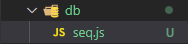

导入sequelize

```js
const { Sequelize } = require('sequelize')
```

实例化一个sequelize对象

 ```JS
 // 数据库连接参数配置，参数：db数据库名，username用户名，password密码，{host主机名，dialect数据库类型}
 const seq = new Sequelize(MYSQL_DB, MYSQL_USER, MYSQL_PWD, {
   host: MYSQL_HOST,
   dialect: 'mysql',
 });
 ```

连接数据库

使用的是sequelize包的`.authenticate()`方法

返回的是一个Promise，所以可以`await`或者`.then/.catch`

```js
// 连接数据库
seq
  .authenticate()
  .then(() => {
    console.log('数库连接成功！');
  })
  .catch(err => {
    console.log('数据库连接失败', err);
  });
```

## 3 参数统一配置

之前定义了.env来存储参数

```js
MYSQL_HOST = localhost
MYSQL_PORT = 3306
MYSQL_USER = root
MYSQL_PWD = 123456
MYSQL_DB = db_test
```

.env的环境参数会被导出到config.default.js中

在seq.js中导入config.default.js

```js
// 导入配置信息
const {
  MYSQL_HOST,
  MYSQL_PORT,
  MYSQL_USER,
  MYSQL_PWD,
  MYSQL_DB,
} = require('../config/config.default');

// 导入sequelize
const Sequelize = require('sequelize');
// 数据库连接参数配置，参数：db数据库名，username用户名，password密码，{host主机名，dialect数据库类型}
const seq = new Sequelize(MYSQL_DB, MYSQL_USER, MYSQL_PWD, {
  host: MYSQL_HOST,
  dialect: 'mysql',
});
```


# 八、创建对象模型

- sequelize将数据库中的数据表，抽象成一个对象模型，该对象模型的名称：人为手动设置=表的表名/默认使用表名的复数(inflection库)/人为手动设置指定名；模型的各个属性column(列名)：对应表的字段；模型的方法：对应对某字段的处理方式
- 首先：model是一个抽象的类，是数据库的表的一种对象映射。创建模型时，有两种方法可以选择：
  - 1、sequelize(实例).define()
  - 2、Model(类).init()
- 创建方法的区别：
  - 1、从sequelize实例上直接调用define，那么这个model是与sequelize连接，从实例上新初始化一个Model类的实例
  - 2、从独立的Model类中初始化一个实例，在实例化之前，需要继承Model，那么这个实例也是独立的，需要将其与sequelize实例相连接
  - 3、其实内部：调用的是Model.init()方法
- sequelize 会自动维护一个id字段，作为主键，并且自增

## 1 创建对象模型

使用.define()方法

```js
// 导入sequelize和其中创建模型的方法
const { DataTypes } = require('sequelize');

// 导入sequelize实例化对象，即：seq文件下创建的对象
const seq = require('../db/seq');

const User = seq.define(
  // model名称
  'User',
  // 对应的数据表的列名
  {
    // 列名
    firstName: {
      // 列的属性
      // 类型
      type: DataTypes.STRING,
    },
    lastName: {
      type: DataTypes.STRING,
    },
  },
  // 其他参数
  {}
);
```

使用Model.init()

```js
// 导入sequelize和其中创建模型的方法
const { DataTypes } = require('sequelize');

// 导入sequelize实例化对象，即：seq文件下创建的对象
const seq = require('../db/seq');

class User extends Model {}
User.init(
  // 对应的数据表的列名
  {
    firstName: {
      type: DataTypes.STRING,
    },
    lastName: {
      type: DataTypes.STRING,
    },
  },
  // 其他参数：必填：连接的实例
  { seq }
);
```

### 1.1 补充表名推断

sequelize的Model映射数据表时，会对数据表的表名做推断：

- 默认：Model名称的复数（内部用的是inflection库）
- 手动设置一个固定值：`tableName: '自定义名称'`
- 手动强制 = Model名称：`freezeTableName: true`

### 1.2 数据类型：必填

sequelize内置了很多数据类型，要使用的话，需要导入`DataTypes`

```js
const { DataTypes } = require('sequelize');

// 伪代码举例：
password: {
      type: DataTypes.STRING,
    },
```

## 2 创建Model完毕，模型同步

### 2.1、sync()同步

在创建完毕Model后，需要执行一个sync()，同步数据表

- `User.sync()`：如果表不存在，则创建；存在，则不执行任何操作

- `User.sync({ force: true })` ：如果表不存在，则创建；如果存在这张表，将会强制删除这张表，再重新创建

- `User.sync({ alter: true })`：将表的数据记录强制与Model的设置匹配

  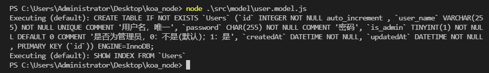

### 2.2、TIMESTAMPS时间戳

在使用模型创建一个数据表后，mysql会主动创建两个时间戳字段：

- createAt 创建表的时间
- updateAt 表修改更新的时间

如果不需要这两个字段，需要在使用model建表时，添加额外的参数：`{ timestamps: false }`

```js
sequelize.define('User', {
  // ... (属性)
}, {
  timestamps: false
});
```

如果只需要其中一个字段

```js
class Foo extends Model {}
Foo.init({ /* 属性 */ }, {
  sequelize,

  // 不要忘记启用时间戳！
  timestamps: true,

  // 不想要 createdAt
  createdAt: false,

  // 想要 updatedAt 但是希望名称叫做 updateTimestamp
  updatedAt: 'updateTimestamp'
});
```

## 3 导出模型

在直接使用脚本同步完数据表后，可以将同步的设置关闭，因为重复地删除和生成表会造成资源损耗

```js
// 同步数据表，{ force: true }，数据表存在，则删除，重新创建
// User.sync({ force: true });
User.sync();
```

导出模型，将会在service层对数据库的表进行操作

```js
module.exports = User;
```


# 九 对象模型对数据表的操作

## 1 插入数据

### 1.1、 `Model.create({ key: value })` 

- key是Model的一个属性名，对应数据表里的一个字段
- value是即将要插入数据表的值，可以是传过来的，也可以是hardcode写死的，总之就是给数据表的字段插入一个value

- 调用的是Model.build()构建未保存实例，并调用Model.save()来保存；create是一种简写形式

### 1.2、指定(限制) 修改的项

```js
const user = await User.create({
  username: 'alice123',
  isAdmin: true
}, 
// 通过fields 来指定需要修改的项
{ fields: ['username'] }
);
// 假设 isAdmin 的默认值为 false
console.log(user.username); // 'alice123'
console.log(user.isAdmin); // false
```

### 1.3、实际操作

```js
// 使用了ES6的简写形式，当key和value都一样时，只需写一个
class UserService {
  async createUser(user_name, password) {
    // 对象模型插入数据
    const res = await User.create({ user_name, password });
    console.log(res)
  }
}
```

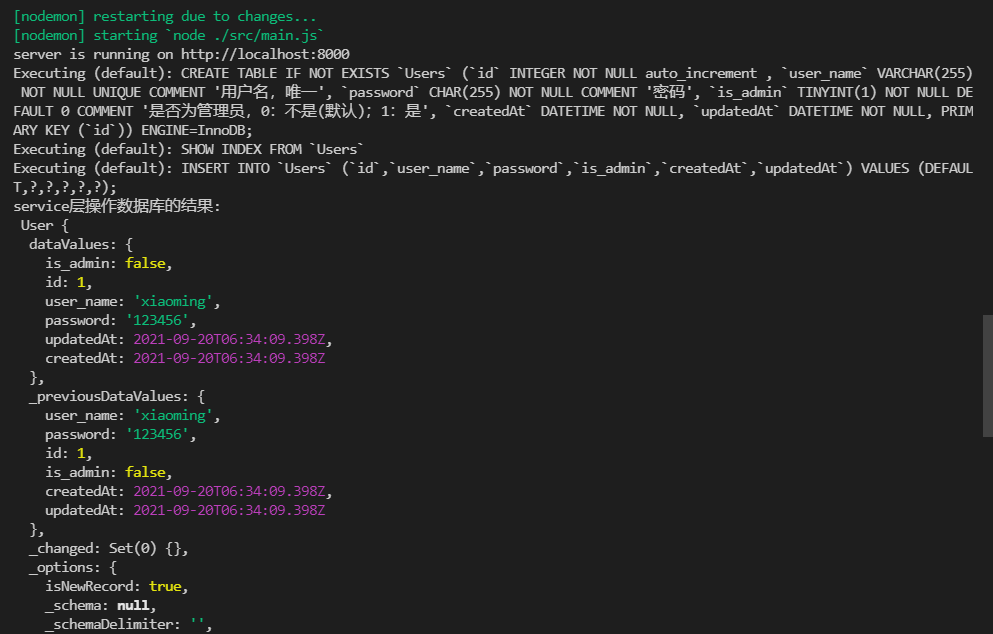

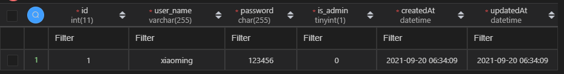

可以看到，插入数据到数据表后，返回的res中含有大量可过滤的信息，我们只需要dataValues这一项，这一项也正是对应到我们数据表中**插入的那一项**


# 十、数据表操作成功，返回处理

利用Model的create方法，可以成功将数据插入到数据表中，并且有详细的返回信息res；在controller中，我们只需使用到res.dataValues这一项。所以在service层，只需要将该项返回出去就好了

```js
// user.service.js中的部分代码

class UserService {
  async createUser(user_name, password) {
    // 对象模型插入数据
    const res = await User.create({ user_name, password });
    // console.log('service层操作数据库的结果:\n', res);
    // 将结果返回给controller层
    // res是较为详细的信息，其实要用到的是res.dataValues
    return res.dataValues;
  }
}
```

```js
// user.controller.js中的部分代码，从service层获取到的res，是处理过后的dataValues

async register(ctx, next) {
    // 1、获取数据
    // 控制台看一下请求体
    // console.log(ctx.request.body); // 使用post方法时，在postman上配置request内容，可以在控制台打印出来
    // 如果客户端也要查看请求体的内容，就赋值给ctx.body，客户端可以拿到
    // 用解构赋值，将post请求体中的json格式内容，赋值给对应的变量
    const { user_name, password } = ctx.request.body;
    // 2、操作数据库
    const res = await createUser(user_name, password);
    console.log(res);
    ctx.body = ctx.request.body;
  }
```

## 1 ctx.body的处理

ctx.body是作为响应数据返回出去的

在之前的代码里，都是：`ctx.body = ctx.request.body` 

这就意味着：成功返回出去的数据 = 请求时候的数据，这就没什么意义了，所以要正式处理一下返回出去的数据，从结构和内容上做规范

## 2 需要的参数

code:：0-成功，0

message：备注信息，" "

result：结果 { }

```js
ctx.body = {
    code: 0,
    message: "数据插入成功！",
    result:{
        id: res.id,
        user_name: res.user_name, 
    }
}
```

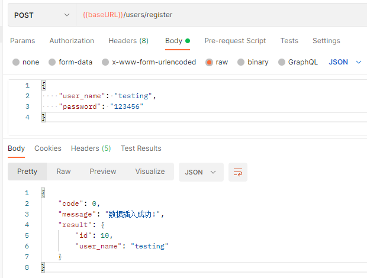

# 十一：小结

发送请求 -> 交由路由处理 -> 路由中找到对应的控制器的方法 ->  控制器的方法里提取请求体的关键数据 -> 调用service，实现对数据库的操作 -> 返回操作后结果


# 十二 错误处理

## 1 错误类型 

- validation Error

验证器错误：该key可能是唯一性的，但是重复post，写入数据库时出现了已存在的key值，那么就会报错

- xxxkey cannot be null

请求时没有传递到该key，由于该key需要传递并且需要带值传递，如果不传，那么就会报错

## 2 处理方式

### 2.1 合法性

在controller中，对request.body中的数据做合法性校验

因为每次请求都要去到controller层，寻找对应的处理函数，那么就在对应的处理函数中，对请求体的参数做一次校验，再决定是否进行数据库操作

```js
	// 1、获取数据
    // 控制台看一下请求体
    // console.log(ctx.request.body); // 使用post方法时，在postman上配置request内容，可以在控制台打印出来
    // 如果客户端也要查看请求体的内容，就赋值给ctx.body，客户端可以拿到
    // 用解构赋值，将post请求体中的json格式内容，赋值给对应的变量
    const { user_name, password } = ctx.request.body;
    // 补充：对传入的请求体内参数做校验
    // 合法性
    if (!user_name || !password) {
      console.error('用户名或密码为空', ctx.request.body);
      ctx.status = 400; // bad request
      ctx.body = {
        code: '10001',
        message: '用户名或密码为空',
        result: '',
      };
      // 参数不合法时，中断执行
      return;
    }
```

- 测试：

postman：代码修改：code值为string

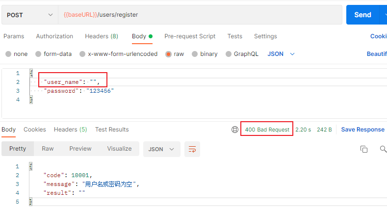

控制台：

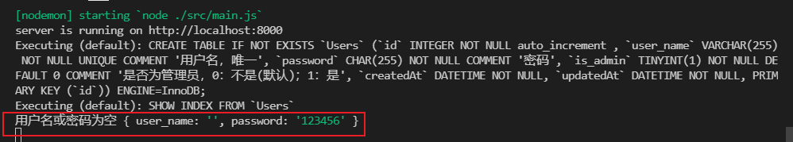

### 2.2 合理性

当数据库中已存在该用户名，则不允许再次创建

可以通过查询来判断，如果能找到对应的用户名，则中断后续操作；如果找不到，则可以进行下一步操作

- 由于涉及到对数据库的操作，那么就将此 **查询操作** 封装到service层，实现解耦与模块独立

- 通过用户名去查找数据库

service层封装的查询用户信息接口：因为可以通过多个参数作为条件去查找，所以将参数定义作对象，并列举出所有可以查找的条件，当其中任意一个参数被传进来，就可以使用条件拼接的方式，准确获取目标用户信息

```js
// user.service.js
// 查询/获取用户信息
  async getUserInfo({ id, user_name, password, is_admin }) {
    // 使用短路运算，拼接查询条件
    // 数据库查询条件where是一个对象类型
    const whereOpt = {};
    id && Object.assign(whereOpt, { id });
    user_name && Object.assign(whereOpt, { user_name });
    password && Object.assign(whereOpt, { password });
    is_admin && Object.assign(whereOpt, { is_admin });
      
    // findOne异步查询
    // 参数：attributes:{}-需要查询的字段；where:{}-条件
    User.findOne({
      attributes: ['id', 'user_name', 'password', 'is_admin'],
      where: whereOpt,
    });
    return res ? res.dataValues : null;
  }
}
```

回到controller层，在检查合理性阶段，调用service层的getUserInfo接口，返回的res有值，则说明用户存在；返回null，则说明用户不存在，可以进行注册操作

```js
	// 合理性
    // service层的查询接口要求参数类型是对象，所以这里需要传递一个对象
    if (getUserInfo({ user_name })) {
      console.error('用户已经存在!');
      ctx.status = 409; // conflict
      ctx.body = {
        code: '10002',
        message: '用户已经存在',
        result: '',
      };
      return;
    }
```

- 测试

  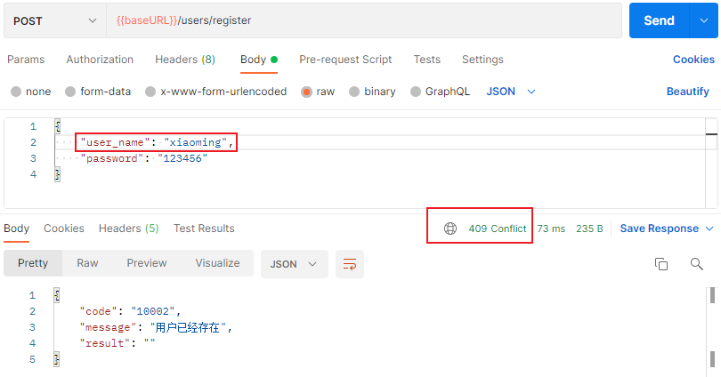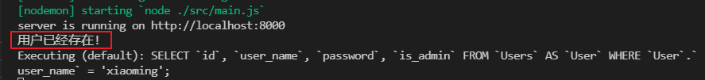


### 2.3 http响应码对照

https://developer.mozilla.org/zh-CN/docs/Web/HTTP/Status/100


# 十三、拆分中间件

## 1 参数验证器

将错误处理抽离出来，作为一个统一的验证处理中间件，需要时调用，避免在主逻辑中写过多重复冗余的错误处理和验证的代码

参数：当调用中间件时，会默认将ctx和next传进来

首先需要从ctx中解构出来需要验证的参数，在进行逻辑验证

- 验证器：合法性验证

  ```js
  // 验证器
  const userValidator = async (ctx, next) => {
      // 解构出参数
      const { user_name, password } = ctx.request.body;
      // 合法性
      // 不合法时：
      if (!user_name || !password) {
        console.error('用户名或密码为空', ctx.request.body);
        ctx.status = 400; // bad request
        ctx.body = {
          code: '10001',
          message: '用户名或密码为空',
          result: '',
        };
        // 参数不合法时，中断执行
        return;
      }
      // 合法时：
      // 交由下一个中间件处理
      await next();
  };
  ```

  

改变逻辑顺序：

- 原本：
  - 当请求到某一路由时，直接交由controller中的处理函数处理，之前的错误处理也是写在controller里面，所以显得很冗杂。
- 现在：
  - 当请求到某一路由时，先由验证器对传来的参数进行校验，再判断是否可以交由对应controller，这样也算是一种合理的验证步骤

逻辑改写：

- 直接在router层，导入验证器，在controller之前由验证器把关

  ```js
  // router层
  // 导入验证器中间件
  const {userValidator} = require("../middleware/user.middleware.js");
  // 在路由controller之前调用
  userRouter.post('/register', userValidator, register);
  ```

## 补充：post的参数解释

post 方式的参数解释：

- 第一个参数：path，路径

- 第二个参数：中间件

- 第三个参数：中间件

  ...

- 中间件之间的顺序调用，由上一个中间件的 **next()** 来决定

  - 比如：此时传进的参数需要经过验证器中间件验证成功后，再交由controller中的register处理，那么在验证器中间件中，判断参数合法，则调用：**next()**
    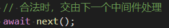

## 2 用户验证器

此验证器是以某个字段为查询条件，从数据库中获取用户信息，如果查询不到，则表明用户不存在；如果能查询得到，则表明用户已经存在

中间件层：

```js
// 用户验证器-合理性
const verifyUser = async (ctx, next) => {
  const { user_name } = ctx.request.body;
  // service层的查询接口要求参数类型是对象，所以这里需要传递一个对象
  if (getUserInfo({ user_name })) {
    console.error('用户已经存在-来自中间件层log记录', ctx.request.body);
    ctx.status = 409; // conflict
    ctx.body = {
      code: '10002',
      message: '用户已经存在',
      result: '',
    };
    return;
  }
  // 交由下一个中间件处理
  await next();
};

// 同理，需要导出这个中间件，并且在router层进行导入后方可使用
```


# 十四 错误的统一管理

即使拆分出来了部分中间件，对错误的情况进行了回调处理，但是每一个中间件的错误log内容都看起来结构类似，所以有了新的思路：

- 将错误类型以常量划分，在错误处理的中间件里面，通过`emit('error')`事件，将错误事件广播/发射出去
- 再由`koa.app`以`.on()`监听的方式，捕获error事件，进行错误处理
- 另：如果错误处理函数都写在`app/index`，会显得冗余，那么就在index同级下创建errHandler.js来处理错误事件

## 1 错误常量的定义

```js
// 常见的错误类型及其返回出去的log内容
module.exports = {
  // 用户格式错误
  userFormatError: {
    code: '10001',
    message: '用户名或密码为空',
    result: '',
  },
  // 用户已存在
  userAlreadyExisted: {
    code: '10002',
    message: '用户已经存在',
    result: '',
  },
};
```

## 2 middleware层调用，并`emit('error')`

```js
// 参数验证器-合法性
const userValidator = async (ctx, next) => {
  // 解构参数
  const { user_name, password } = ctx.request.body;
  // 合法性
  // 不合法时:
  if (!user_name || !password) {
    // 将错误信息提交到app中，由app来同一处理
    ctx.app.emit('error', userFormatError, ctx);
    // 参数不合法时，中断执行
    return;
  }
  // 合法时，交由下一个中间件处理
  await next();
};
```

## 3 errhandler 错误处理函数

这个错误处理函数是直接导出一个匿名函数，所以在index中导入使用时，是直接用名称就相当于一个函数了

```js
// errhandler.js
// app中的错误统一处理模块
module.exports = (err, ctx) => {
  let status = 500;
  switch (err.code) {
    case '10001':
      status = 400;
      break;
    case '10002':
      status = 409;
      break;
    default:
      status = 500;
      break;
  }
  ctx.status == status;
  ctx.body = err;
};
```

## 4 index中的使用

```js
// 错误事件处理函数
const errhandler = require('./errhandler');

// 统一错误事件监听，处理
// 因为errhandler导出的是一个匿名函数，所以这里直接使用即可
app.on('error', errhandler);
```


 
