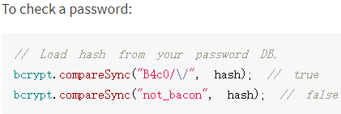
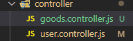
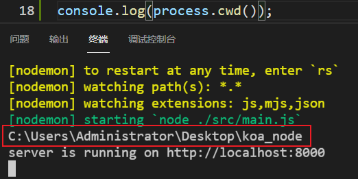
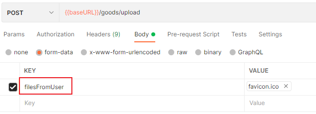

# 一、项目的的初始化

## 1 npm 初始化 

`npm init -y`

生成`package.json`文件

- 记录项目的依赖

## 2 git初始化

`git init`

生成`git`隐藏文件夹，git的本地仓库

## 3 创建Readme

项目指引

# 二、搭建项目

## 1 安装Koa框架

`npm i koa`

## 2 编写最基本的app

```js
// 导入Koa类
const Koa = require('koa');

// 实例化一个对象
const app = new Koa();

// 使用中间件
app.use((ctx, next) => {
  ctx.body = 'Hello Koa from main.js';
});

// 监听3000端口，对端口的所有http请求做出对应的回调响应
app.listen(3000, () => {
  console.log('server is running on http://localhost:3000');
});
```

## 3 测试

在终端，输入`node src/main.js` 开启服务

# 三、优化

## 1 起服务的优化

- 使用node起服务，每次修改后，需要重启服务，为了做到保存时，免于手动重启，将node 改为 nodemon，由nodemon来监听文件的改变，自动重启服务

- `npm i nodemon` 只是装了package，需要配置对应的脚本来使用

  ```js
  // 在packa.json的scripts下，配置脚本   
  "dev": "nodemon ./src/main.js",
      
  // 在控制台使用npm run dev 就起服务了
  ```

  

- **工具优化更新**：
  
  - 由于nodemon只是开发时需要用到，所以不需要把它放到dependencies中
  - 卸载依赖：`npn un xxx`
  - 在安装的时候，使用`npm i xxx -D `将依赖安装到dev开发环境中
  - 

## 2 读取配置文件

- 安装 `npm i dotenv`

```js
npm i dotenv
```

- 根目录下创建`.env`文件，里面是环境配置的信息

  ```js
  APP_PORT = 3000
  ```

  

- 在`src`目录下创建不同的配置文件：主要是为了区别开来

  - config.default.js是默认的，生产环境
  - config.dev.js是开发环境的

## 3 导入dotenv，导出配置信息对象

- 在`config.default.js`中导入dotenv

  ```js
  // 导入
  const dotenv = require("dotenv");
  
  // 启动配置（官方默认）
  dotenv.config();
  
  // 获取.env的配置信息
  console.log(process.env.APP_PORT);
  
  // process.env是官方默认的配置信息对象，读取的就是.env的内容
  
  // 再将配置信息对象导出
  module.exports = process.env;
  ```

 ## 4 main.js文件中的引用

- 上文已经将配置信息对象导出，那么就在这里引用

  ```js
  // 引用
  const {APP_PORT} = require("./config/config.default.js");
  
  // 在监听端口时，可以使用 配置的端口信息，来监听不同的端口
  app.listen(APP_PORT,()=>{
      console.log(`running on http://localhost:${APP_PORT}`)
  })
  ```

  

# 四、路由

路由：根据不同的URL，调用对应的处理函数

## 1 安装路由中间件

通过命令`npm i koa-router`

步骤：

- 导入
- 实例化对象
- 编写路由
- 注册中间件

```js
// 导入路由
const Router = require('koa-router');
// 实例化路由对象
const indexRouter = new Router();
const userRouter = new Router();
// 编写路由
indexRouter.get('/', (ctx, next) => {
  ctx.body = 'This is router from index';
});
userRouter.get('/users', (ctx, next) => {
  ctx.body = 'This is router from users';
});
// 注册中间件，中间件必须是一个函数，所以调用的是koa-router的routes()函数
app.use(indexRouter.routes());
app.use(userRouter.routes());
```

## 2 重构路由

如果将所有的路由处理都写在main文件中，且每次都要

- 实例化
- 编写路由
- 注册

会让main显得特别的拖沓

所以将route模块独立出来，解耦

- 在src目录下创建一个文件夹router用于处理所有的路由
- 将所有的路由细分，如：处理/users/的路由，定义为：user.route.js

```js
// 将main中的路由部分转移到这里
// 导入路由中间件
const Router = require('koa-router');
// 实例化
// prefix参数是默认拼接参数，即：prefix+处理函数中的路径，才是最终的路由
const userRouter = new Router({ prefix: '/users' });

// 处理Get，最终实际获得：prefix+路径 = /users/
// 第一个参数是路径，第二个参数是回调处理函数
userRouter.get('/', (ctx, next) => {
  ctx.body = 'hello users';
});

// 导出userRouter
module.exports = userRouter;

-----------------------------------------------------------------
// main中的调用
// 导入路由文件
const userRouter = require('./router/user.route');

// 注册路由中间件
app.use(userRouter.routes())
```

# 五、项目目录结构优化

## 1、将http服务和app业务拆分

创建`src/app/index`目录

app目录下创建index.js文件，用作项目业务相关代码目录

```js
// index.js
// 导入
// Koa
const Koa = require('koa');
// 路由
const userRouter = require('../router/user.route');

// 实例化
// Koa的实例
const app = new Koa();
// 注册中间件，路由中间件的实例
app.use(userRouter.routes());

// 导出
// 给main.js中使用
module.exports = app;
```

## 2、改写main.js 入口文件

```js
// 导入
// 导入index中实例化的Koa
const app = require('./app/index');
// 导入config文件
const { APP_PORT } = require('./config/config.default');

app.listen(APP_PORT, () => {
  console.log(`server is running on http://localhost:${APP_PORT}`);
  //   console.log(`server is running on http://localhost:/3000`);
});
```

## 3、路由业务的抽离

将路由中的回调处理函数抽离，集成在`controller`目录，在router中调用时，采用结构赋值的方式，使用某个模块下的某个界面的路由

- 针对用户的路由处理：`user.controller.js`

```js
// user.controller.js文件
class userController {
  async register(ctx, next) {
    ctx.body = '用户注册成功';
  }
}

// 导出
// 不直接导出这个类，而是导出这个类实例化出的对象
// 导出给user.route.js使用
module.exports = new userController();

------------------------------------------------------------------
// 路由模块的导入和使用
// 新版：通过controller下的对应处理文件来触发回调
// require的是controller中实例化出来的一个对象，我们要使用的是对象中的一个方法，所以进行解构
const { register } = require('../controller/user.controller');

// 根据接口文档，使用正确的http方式：(get/post...)
userRouter.post('/register', register);


```

## 4、postman的使用

1、创建一个项目文件夹

`商城项目`

2、创建模块文件夹

`用户模块`

3、接口文件

`用户注册接口`、`用户登录接口`


4、创建环境

开发环境：dev_env


5、在接口文件中选择正确的环境，填写对应的URL


6、接口测试：点击send，看返回的结果


# 六、解析body

1、安装koa-body中间件

`npm i koa-body`

2、注意事项：解析body，必须要在router之前，否则不生效

3、在postman配置post的数据


4、去到路由处理文件controller.js中，在对应的接口下设置查看post的数据

```js
async register(ctx, next) {
    // 控制台看一下请求体
    console.log(ctx.request.body); // 使用post方法时，在postman上配置request内容，可以在控制台打印出来
    // 如果客户端也要查看请求体的内容，就赋值给ctx.body，客户端可以拿到
    ctx.body = ctx.request.body;
  }
```


5、在postman点击send，可以在控制台获取到的post数据

```js
console.log(ctx.request.body);
```


**主要步骤解释：**

- 获取数据
- 操作数据库
- 返回结果

## 2 注册中间件

改写app/index.js

```js
// 请求体内容解析，这个中间件的导入和注册，必须在路由的内容之前
const KoaBody = require('koa-body');

// koa-body中间件的注册，必须在路由中间件之前
app.use(KoaBody());
```


## 3 解析请求数据

改写user.controller.js：拿数据，操作数据库，返回结果

```js
// 导入数据库操作，因为这里的数据库操作是异步的，所以拿到return回来的结果是一个promise，所以要使用这个方法时，要用await
const { createUser } = require('../service/user.service');
class userController {
  async register(ctx, next) {
    // 1、获取数据
    // 控制台看一下请求体
    // console.log(ctx.request.body); // 使用post方法时，在postman上配置request内容，可以在控制台打印出来
    // 如果客户端也要查看请求体的内容，就赋值给ctx.body，客户端可以拿到
    // 用解构赋值，将post请求体中的json格式内容，赋值给对应的变量
    const { user_name, password } = ctx.request.body;
    // 2、操作数据库
    const res = await createUser(user_name, password);
    console.log(res);
    ctx.body = ctx.request.body;
  }
  async login(ctx, next) {
    ctx.body = '登录成功';
  }
}

// 导出
// 不直接导出这个类，而是导出这个类实例化出的对象
// 导出给user.route.js使用
module.exports = new userController();

```

## 4 拆分service层

service层主要是做数据库的处理

创建 `src/service/user.service.js`

```js
// 用于操作数据库的层级，从路由层单独抽离出来，解耦
class UserService {
  async createUser(user_name, password) {
    // todo:写入数据库
    return '写入数据库,成功';
  }
}

// 导出数据库操作，主要是路由层使用，所以要在路由controller中导入
module.exports = new UserService();

```


# 七、数据库操作

sequelize ORM数据库工具

ORM ： 对象关系映射，object relational mapping

- 数据表映射(对应)一个类
- 数据表中的数据行(记录)对应一个对象；（由数据表的类实例化出来的一个对象）
- 数据表的字段对应对象的属性 
- 对数据表的操作对应对象的方法；（被映射成这个类实例化出来的对象中的一个方法）


## 1 安装

安装对应插件:sequelize

`npm i sequelize`

还需要安装对应的数据库驱动:mysql2

`npm i mysql2 `


## 2 连接到数据库

创建db/seq.js：用于插件操作数据库


导入sequelize

```js
const { Sequelize } = require('sequelize')
```

实例化一个sequelize对象

 ```JS
 // 数据库连接参数配置，参数：db数据库名，username用户名，password密码，{host主机名，dialect数据库类型}
 const seq = new Sequelize(MYSQL_DB, MYSQL_USER, MYSQL_PWD, {
   host: MYSQL_HOST,
   dialect: 'mysql',
 });
 ```

连接数据库

使用的是sequelize包的`.authenticate()`方法

返回的是一个Promise，所以可以`await`或者`.then/.catch`

```js
// 连接数据库
seq
  .authenticate()
  .then(() => {
    console.log('数库连接成功！');
  })
  .catch(err => {
    console.log('数据库连接失败', err);
  });
```

## 3 参数统一配置

之前定义了.env来存储参数

```js
MYSQL_HOST = localhost
MYSQL_PORT = 3306
MYSQL_USER = root
MYSQL_PWD = 123456
MYSQL_DB = db_test
```

.env的环境参数会被导出到config.default.js中

在seq.js中导入config.default.js

```js
// 导入配置信息
const {
  MYSQL_HOST,
  MYSQL_PORT,
  MYSQL_USER,
  MYSQL_PWD,
  MYSQL_DB,
} = require('../config/config.default');

// 导入sequelize
const Sequelize = require('sequelize');
// 数据库连接参数配置，参数：db数据库名，username用户名，password密码，{host主机名，dialect数据库类型}
const seq = new Sequelize(MYSQL_DB, MYSQL_USER, MYSQL_PWD, {
  host: MYSQL_HOST,
  dialect: 'mysql',
});
```


# 八、创建对象模型

- sequelize将数据库中的数据表，抽象成一个对象模型，该对象模型的名称：人为手动设置=表的表名/默认使用表名的复数(inflection库)/人为手动设置指定名；模型的各个属性column(列名)：对应表的字段；模型的方法：对应对某字段的处理方式
- 首先：model是一个抽象的类，是数据库的表的一种对象映射。创建模型时，有两种方法可以选择：
  - 1、sequelize(实例).define()
  - 2、Model(类).init()
- 创建方法的区别：
  - 1、从sequelize实例上直接调用define，那么这个model是与sequelize连接，从实例上新初始化一个Model类的实例
  - 2、从独立的Model类中初始化一个实例，在实例化之前，需要继承Model，那么这个实例也是独立的，需要将其与sequelize实例相连接
  - 3、其实内部：调用的是Model.init()方法
- sequelize 会自动维护一个id字段，作为主键，并且自增

## 1 创建对象模型

使用.define()方法

```js
// 导入sequelize和其中创建模型的方法
const { DataTypes } = require('sequelize');

// 导入sequelize实例化对象，即：seq文件下创建的对象
const seq = require('../db/seq');

const User = seq.define(
  // model名称
  'User',
  // 对应的数据表的列名
  {
    // 列名
    firstName: {
      // 列的属性
      // 类型
      type: DataTypes.STRING,
    },
    lastName: {
      type: DataTypes.STRING,
    },
  },
  // 其他参数
  {}
);
```

使用Model.init()

```js
// 导入sequelize和其中创建模型的方法
const { DataTypes } = require('sequelize');

// 导入sequelize实例化对象，即：seq文件下创建的对象
const seq = require('../db/seq');

class User extends Model {}
User.init(
  // 对应的数据表的列名
  {
    firstName: {
      type: DataTypes.STRING,
    },
    lastName: {
      type: DataTypes.STRING,
    },
  },
  // 其他参数：必填：连接的实例
  { seq }
);
```

### 1.1 补充表名推断

sequelize的Model映射数据表时，会对数据表的表名做推断：

- 默认：Model名称的复数（内部用的是inflection库）
- 手动设置一个固定值：`tableName: '自定义名称'`
- 手动强制 = Model名称：`freezeTableName: true`

### 1.2 数据类型：必填

sequelize内置了很多数据类型，要使用的话，需要导入`DataTypes`

```js
const { DataTypes } = require('sequelize');

// 伪代码举例：
password: {
      type: DataTypes.STRING,
    },
```

## 2 创建Model完毕，模型同步

### 2.1、sync()同步

在创建完毕Model后，需要执行一个sync()，同步数据表

- `User.sync()`：如果表不存在，则创建；存在，则不执行任何操作

- `User.sync({ force: true })` ：如果表不存在，则创建；如果存在这张表，将会强制删除这张表，再重新创建

- `User.sync({ alter: true })`：将表的数据记录强制与Model的设置匹配

  

### 2.2、TIMESTAMPS时间戳

在使用模型创建一个数据表后，mysql会主动创建两个时间戳字段：

- createAt 创建表的时间
- updateAt 表修改更新的时间

如果不需要这两个字段，需要在使用model建表时，添加额外的参数：`{ timestamps: false }`

```js
sequelize.define('User', {
  // ... (属性)
}, {
  timestamps: false
});
```

如果只需要其中一个字段

```js
class Foo extends Model {}
Foo.init({ /* 属性 */ }, {
  sequelize,

  // 不要忘记启用时间戳！
  timestamps: true,

  // 不想要 createdAt
  createdAt: false,

  // 想要 updatedAt 但是希望名称叫做 updateTimestamp
  updatedAt: 'updateTimestamp'
});
```

## 3 导出模型

在直接使用脚本同步完数据表后，可以将同步的设置关闭，因为重复地删除和生成表会造成资源损耗

```js
// 同步数据表，{ force: true }，数据表存在，则删除，重新创建
// User.sync({ force: true });
User.sync();
```

导出模型，将会在service层对数据库的表进行操作

```js
module.exports = User;
```


# 九 对象模型对数据表的操作

## 1 插入数据

### 1.1、 `Model.create({ key: value })` 

- key是Model的一个属性名，对应数据表里的一个字段
- value是即将要插入数据表的值，可以是传过来的，也可以是hardcode写死的，总之就是给数据表的字段插入一个value

- 调用的是Model.build()构建未保存实例，并调用Model.save()来保存；create是一种简写形式

### 1.2、指定(限制) 修改的项

```js
const user = await User.create({
  username: 'alice123',
  isAdmin: true
}, 
// 通过fields 来指定需要修改的项
{ fields: ['username'] }
);
// 假设 isAdmin 的默认值为 false
console.log(user.username); // 'alice123'
console.log(user.isAdmin); // false
```

### 1.3、实际操作

```js
// 使用了ES6的简写形式，当key和value都一样时，只需写一个
class UserService {
  async createUser(user_name, password) {
    // 对象模型插入数据
    const res = await User.create({ user_name, password });
    console.log(res)
  }
}
```


可以看到，插入数据到数据表后，返回的res中含有大量可过滤的信息，我们只需要dataValues这一项，这一项也正是对应到我们数据表中**插入的那一项**


# 十、数据表操作成功，返回处理

利用Model的create方法，可以成功将数据插入到数据表中，并且有详细的返回信息res；在controller中，我们只需使用到res.dataValues这一项。所以在service层，只需要将该项返回出去就好了

```js
// user.service.js中的部分代码

class UserService {
  async createUser(user_name, password) {
    // 对象模型插入数据
    const res = await User.create({ user_name, password });
    // console.log('service层操作数据库的结果:\n', res);
    // 将结果返回给controller层
    // res是较为详细的信息，其实要用到的是res.dataValues
    return res.dataValues;
  }
}
```

```js
// user.controller.js中的部分代码，从service层获取到的res，是处理过后的dataValues

async register(ctx, next) {
    // 1、获取数据
    // 控制台看一下请求体
    // console.log(ctx.request.body); // 使用post方法时，在postman上配置request内容，可以在控制台打印出来
    // 如果客户端也要查看请求体的内容，就赋值给ctx.body，客户端可以拿到
    // 用解构赋值，将post请求体中的json格式内容，赋值给对应的变量
    const { user_name, password } = ctx.request.body;
    // 2、操作数据库
    const res = await createUser(user_name, password);
    console.log(res);
    ctx.body = ctx.request.body;
  }
```

## 1 ctx.body的处理

ctx.body是作为响应数据返回出去的

在之前的代码里，都是：`ctx.body = ctx.request.body` 

这就意味着：成功返回出去的数据 = 请求时候的数据，这就没什么意义了，所以要正式处理一下返回出去的数据，从结构和内容上做规范

## 2 需要的参数

code:：0-成功，0

message：备注信息，" "

result：结果 { }

```js
ctx.body = {
    code: 0,
    message: "数据插入成功！",
    result:{
        id: res.id,
        user_name: res.user_name, 
    }
}
```


# 十一：小结

发送请求 -> 交由路由处理 -> 路由中找到对应的控制器的方法 ->  控制器的方法里提取请求体的关键数据 -> 调用service，实现对数据库的操作 -> 返回操作后结果


# 十二 错误处理

## 1 错误类型 

- validation Error

验证器错误：该key可能是唯一性的，但是重复post，写入数据库时出现了已存在的key值，那么就会报错

- xxxkey cannot be null

请求时没有传递到该key，由于该key需要传递并且需要带值传递，如果不传，那么就会报错

## 2 处理方式

### 2.1 合法性

在controller中，对request.body中的数据做合法性校验

因为每次请求都要去到controller层，寻找对应的处理函数，那么就在对应的处理函数中，对请求体的参数做一次校验，再决定是否进行数据库操作

```js
	// 1、获取数据
    // 控制台看一下请求体
    // console.log(ctx.request.body); // 使用post方法时，在postman上配置request内容，可以在控制台打印出来
    // 如果客户端也要查看请求体的内容，就赋值给ctx.body，客户端可以拿到
    // 用解构赋值，将post请求体中的json格式内容，赋值给对应的变量
    const { user_name, password } = ctx.request.body;
    // 补充：对传入的请求体内参数做校验
    // 合法性
    if (!user_name || !password) {
      console.error('用户名或密码为空', ctx.request.body);
      ctx.status = 400; // bad request
      ctx.body = {
        code: '10001',
        message: '用户名或密码为空',
        result: '',
      };
      // 参数不合法时，中断执行
      return;
    }
```

- 测试：

postman：代码修改：code值为string


控制台：


### 2.2 合理性

当数据库中已存在该用户名，则不允许再次创建

可以通过查询来判断，如果能找到对应的用户名，则中断后续操作；如果找不到，则可以进行下一步操作

- 由于涉及到对数据库的操作，那么就将此 **查询操作** 封装到service层，实现解耦与模块独立

- 通过用户名去查找数据库

service层封装的查询用户信息接口：因为可以通过多个参数作为条件去查找，所以将参数定义作对象，并列举出所有可以查找的条件，当其中任意一个参数被传进来，就可以使用条件拼接的方式，准确获取目标用户信息

```js
// user.service.js
// 查询/获取用户信息
  async getUserInfo({ id, user_name, password, is_admin }) {
    // 使用短路运算，拼接查询条件
    // 数据库查询条件where是一个对象类型
    const whereOpt = {};
    id && Object.assign(whereOpt, { id });
    user_name && Object.assign(whereOpt, { user_name });
    password && Object.assign(whereOpt, { password });
    is_admin && Object.assign(whereOpt, { is_admin });
      
    // findOne异步查询
    // 参数：attributes:{}-需要查询的字段；where:{}-条件
    User.findOne({
      attributes: ['id', 'user_name', 'password', 'is_admin'],
      where: whereOpt,
    });
    return res ? res.dataValues : null;
  }
}
```

回到controller层，在检查合理性阶段，调用service层的getUserInfo接口，返回的res有值，则说明用户存在；返回null，则说明用户不存在，可以进行注册操作

```js
	// 合理性
    // service层的查询接口要求参数类型是对象，所以这里需要传递一个对象
    if (getUserInfo({ user_name })) {
      console.error('用户已经存在!');
      ctx.status = 409; // conflict
      ctx.body = {
        code: '10002',
        message: '用户已经存在',
        result: '',
      };
      return;
    }
```

- 测试

  


### 2.3 http响应码对照

https://developer.mozilla.org/zh-CN/docs/Web/HTTP/Status/100


# 十三、拆分中间件

## 1 参数验证器

将错误处理抽离出来，作为一个统一的验证处理中间件，需要时调用，避免在主逻辑中写过多重复冗余的错误处理和验证的代码

参数：当调用中间件时，会默认将ctx和next传进来

首先需要从ctx中解构出来需要验证的参数，在进行逻辑验证

- 验证器：合法性验证

  ```js
  // 验证器
  const userValidator = async (ctx, next) => {
      // 解构出参数
      const { user_name, password } = ctx.request.body;
      // 合法性
      // 不合法时：
      if (!user_name || !password) {
        console.error('用户名或密码为空', ctx.request.body);
        ctx.status = 400; // bad request
        ctx.body = {
          code: '10001',
          message: '用户名或密码为空',
          result: '',
        };
        // 参数不合法时，中断执行
        return;
      }
      // 合法时：
      // 交由下一个中间件处理
      await next();
  };
  ```

  

改变逻辑顺序：

- 原本：
  - 当请求到某一路由时，直接交由controller中的处理函数处理，之前的错误处理也是写在controller里面，所以显得很冗杂。
- 现在：
  - 当请求到某一路由时，先由验证器对传来的参数进行校验，再判断是否可以交由对应controller，这样也算是一种合理的验证步骤

逻辑改写：

- 直接在router层，导入验证器，在controller之前由验证器把关

  ```js
  // router层
  // 导入验证器中间件
  const {userValidator} = require("../middleware/user.middleware.js");
  // 在路由controller之前调用
  userRouter.post('/register', userValidator, register);
  ```

## 补充：post的参数解释

post 方式的参数解释：

- 第一个参数：path，路径

- 第二个参数：中间件

- 第三个参数：中间件

  ...

- 中间件之间的顺序调用，由上一个中间件的 **next()** 来决定

  - 比如：此时传进的参数需要经过验证器中间件验证成功后，再交由controller中的register处理，那么在验证器中间件中，判断参数合法，则调用：**next()**
    

## 2 用户验证器

此验证器是以某个字段为查询条件，从数据库中获取用户信息，如果查询不到，则表明用户不存在；如果能查询得到，则表明用户已经存在

中间件层：

```js
// 用户验证器-合理性
const verifyUser = async (ctx, next) => {
  const { user_name } = ctx.request.body;
  // service层的查询接口要求参数类型是对象，所以这里需要传递一个对象
  if (await getUserInfo({ user_name })) {
    console.error('用户已经存在-来自中间件层log记录', ctx.request.body);
    ctx.status = 409; // conflict
    ctx.body = {
      code: '10002',
      message: '用户已经存在',
      result: '',
    };
    return;
  }
  // 交由下一个中间件处理
  await next();
};

// 同理，需要导出这个中间件，并且在router层进行导入后方可使用
```


# 十四 错误的统一管理

即使拆分出来了部分中间件，对错误的情况进行了回调处理，但是每一个中间件的错误log内容都看起来结构类似，所以有了新的思路：

- 将错误类型以常量划分，在错误处理的中间件里面，通过`emit('error')`事件，将错误事件广播/发射出去
- 再由`koa.app`以`.on()`监听的方式，捕获error事件，进行错误处理
- 另：如果错误处理函数都写在`app/index`，会显得冗余，那么就在index同级下创建errHandler.js来处理错误事件

## 1 错误常量的定义

```js
// 常见的错误类型及其返回出去的log内容
module.exports = {
  // 用户格式错误
  userFormatError: {
    code: '10001',
    message: '用户名或密码为空',
    result: '',
  },
  // 用户已存在
  userAlreadyExisted: {
    code: '10002',
    message: '用户已经存在',
    result: '',
  },
};
```

## 2 middleware层调用，并`emit('error')`

```js
// 参数验证器-合法性
const userValidator = async (ctx, next) => {
  // 解构参数
  const { user_name, password } = ctx.request.body;
  // 合法性
  // 不合法时:
  if (!user_name || !password) {
    // 将错误信息提交到app中，由app来同一处理
    ctx.app.emit('error', userFormatError, ctx);
    // 参数不合法时，中断执行
    return;
  }
  // 合法时，交由下一个中间件处理
  await next();
};
```

## 3 errhandler 错误处理函数

这个错误处理函数是直接导出一个匿名函数，所以在index中导入使用时，是直接用名称就相当于一个函数了

```js
// errhandler.js
// app中的错误统一处理模块
module.exports = (err, ctx) => {
  let status = 500;
  switch (err.code) {
    case '10001':
      status = 400;
      break;
    case '10002':
      status = 409;
      break;
    default:
      status = 500;
      break;
  }
  ctx.status = status;
  ctx.body = err;
};
```

## 4 index中的使用

```js
// 错误事件处理函数
const errhandler = require('./errhandler');

// 统一错误事件监听，处理
// 因为errhandler导出的是一个匿名函数，所以这里直接使用即可
app.on('error', errhandler);
```

## 5 controller中写数据库的容错补充

在register对数据库进行插入数据操作时，也有可能会出现异常情况，那么需要补充一个对错误的捕获

用`try`来包：写数据库操作，`catch`来捕获异常情况

- 新增错误类型

  ```js
  // 用户注册错误，用于controller中的容错
    userRegisterError: {
      code: '10003',
      message: '用户注册错误',
      result: '',
    },
  ```

- 在controller中使用

  ```js
  // controller.js
  // 导入错误情况
  const { userRegisterError } = require('../constant/err.type');
  
  ------------------------------------------------------------
  
  	// 写入数据库的容错，用try/catch来包含
      try {
        const res = await createUser(user_name, password);
        // 3、处理返回出去的数据
        ctx.body = {
          code: 0,
          message: '数据插入成功!',
          result: { id: res.id, user_name: res.user_name },
        };
      } catch (error) {
        // 打印错误
        console.log(error);
        // emit出去，由app做统一错误处理
        ctx.app.emit('error', userRegisterError, ctx);
        return;
      }
  ```

## 6 middleware中对查询数据库的容错补充

在对数据内容进行查询时，也有可能会出现异常情况，同样地，使用`try/catch`来捕获异常

- 在middleware层：

  ```js
    try {
      const res = await getUserInfo({ user_name });
      if (res) {
        // 打印错误信息，记录在服务器中
        console.error('用户已经存在-来自中间件层log记录', user_name);
        // 将错误信息提交到app中，由app来同一处理
        ctx.app.emit('error', userAlreadyExisted, ctx);
        return;
      }
    } catch (error) {
      console.error('获取用户信息错误！', error);
      ctx.app.emit('error', userRegisterError, ctx);
      return;
    }
  ```


# 十五 password加密

在将密码保存到数据库之前，要对密码进行加密处理

加盐加密：原密码+随机字符，进行算法加密；所谓的盐，就是指与原密码无关的字符/用于改变原密码

## 1 使用bcryptjs库

安装：`npm i bcryptjs`

## 2 单一职责原则

 严格执行一个中间件一个功能的原则，不将功能耦合到多个模块，这是为了如果后续更换技术，那么只需要在对应的中间件修改即可

加密中间件实现：

```js
// middleware.js
// 导入bcryptjs库
const bcrypt = require('bcryptjs');

// 加密中间件
// 加密中间件
const cryptPassword = async (ctx, next) => {
  // 获取请求体中的原密码
  const { password } = ctx.request.body;
  // 从加密库中获取salt-盐
  const salt = bcrypt.genSaltSync(10);
  // hash加密，得到的是密文
  const hash = bcrypt.hashSync(password, salt);
  // 用密文代替password返回出去
  ctx.request.body.password = hash;
  // 处理好password。交由下一个中间件处理
  await next();
};

// 导出
module.exports = { cryptPassword }
```

router层的导入与使用：

```js
// route
// 导入
const {
  userValidator,
  verifyUser,
  cryptPassword,
} = require('../middleware/user.middleware');

// 使用
userRouter.post('/register', userValidator, verifyUser, cryptPassword, register);
```

## 3 测试


# 十六 登录

登录流程：

1、post访问到指定路由：`/login`

2、触发一系列中间件

- 校验参数是否合法
- 校验用户是否存在
- 校验密码是否匹配
- 成功登录

3、编写中间件

- 校验参数合法：`userValidator`（复用注册模块）

- 校验用户存在：`verifyLogin`

  ```js
  const verifyLogin = async (ctx, next) => {
    const { user_name } = ctx.request.body;
    try {
      // 1、判断用户是否存在
      // 通过用户名去查询数据库（不存在：报错）
      const res = await getUserInfo({ user_name });
      // 用户不存在
      if (!res) {
        console.error('用户名不存在数据库中', user_name);
        ctx.app.emit('error', userDoesNotExist, ctx);
      }
    } catch (error) {
      console.error(error);
      ctx.app.emit('error', userLoginError, ctx);
    }
    // 2、密码是否匹配（不匹配，报错）
    await next();
  };
  ```

  错误信息类型的补充：

  ```js
    // 用户不存在错误，用于verifyLogin中间件查询不到用户信息
    userDoesNotExist: {
      code: '10004',
      message: '用户不存在数据库中',
      result: '',
    },
    // 用户登录失败，用于verifyLogin中间件catch(error)
    userLoginError: {
      code: '10005',
      message: '用户登录失败',
      result: '',
    },
  ```

  在router层，访问到`/login`接口的回调处理中，添加这个中间件

  ```js
  // router层
  // 导入
  const {
    userValidator,
    verifyUser,
    cryptPassword,
    verifyLogin,
  } = require('../middleware/user.middleware');
  // 添加使用
  userRouter.post('/login', userValidator, verifyLogin, login);
  ```

  -------------------------------------------------------

4 、在verifyLogin中补充：密码匹配步骤

- 使用的是加密库：bcryptjs 的解密（同步解密）
  

```js
const verifyLogin = async (ctx, next) => {
  const { user_name, password } = ctx.request.body;
  try {
    // 1、判断用户是否存在
    // 通过用户名去查询数据库（不存在：报错）
    const res = await getUserInfo({ user_name });
    // 用户不存在
    if (!res) {
      console.error('用户名不存在数据库中', user_name);
      ctx.app.emit('error', userDoesNotExist, ctx);
      return;
    }
    // 2、密码是否匹配（不匹配，报错）
    // 解析出数据库中用户信息的加密密码
    // 密码不匹配
    if (!bcrypt.compareSync(password, res.password)) {
      ctx.app.emit('error', invalidPasword, ctx);
      return;
    }
  } catch (error) {
    console.error(error);
    ctx.app.emit('error', userLoginError, ctx);
    return;
  }
  // 密码匹配，交由下一个中间件处理
  await next();
};
```

补充密码不匹配错误信息：

```js
  // 用户密码不匹配，用于verifyLogin中间件的解密
  invalidPasword: {
    code: '10006',
    message: '密码不匹配',
    result: '',
  },
```

5、 测试

- 正常情况，密码匹配登录成功
  

- 错误情况一：用户不存在
  

- 错误情况二：用户密码不正确
  

- 参数错误的测试之前做过了，这里就不补充了

---

## 一个搞笑的bug：errhandler.js有几率在修改保存后，没能成功触发，需要多保存几次/重新run dev

---

# 十七 用户的认证：token颁发

主要是通过登录成功后，会给用户颁发一个令牌：token，用户在之后的每一次请求中携带这个令牌，服务端要对这个令牌的时效性和有效性进行校验

由于前后端分离，这里使用的是：`jwt -json web token`


头部 header：


载荷 payload：


签名 signature：


## 1 安装token库

`npm i jsonwebtoken`

## 2 在controller中导入

因为颁发token是在登录成功后，处理登录成功后的函数在controller中，其余的校验方式是中间件，在middleware中

```js
const jwt = require('jsonwebtoken')
```

---

## 3 新解构赋值写法补充：

从某一对象中剔除掉一部分属性，将剩下的属性值赋值给一个新的对象

```js
// 例如：user = { 'name':'xiaoming', 'sex':'man', 'age': 18 }
// 需要将sex属性剔除，将name和age属性赋值给新的对象userInfo

// 将需要剔除的属性单独赋值，再将其余属性解构赋值
// 这里的sex必须和user中的属性名一致
const { sex, ...userInfo } = user;

// 这里需要注意的是：二次赋值时，单独赋值的属性名和要剔除的属性名要一致
// 新赋值的对象名称可以任意

// 这样userInfo就是除了sex属性之外，另一形式的user的存在了
console.log(sex) // man 
console.log(userInfo) // { name: 'xiaoming', age: 18 }

// 同样地，对剔除多个属性的情况一样有效
```

---

## 4 配置一个密钥

到`.env` 下增加一个密钥项

```js
JWT_SECRET = abc
```

## 5 token配置参数

- 载荷：常见一个对象类型
- 密钥：常见一个字符串类型
- （可选）超时时间：一个对象：`{expiresIn:1d}`=1天 // 为了之后快速过期，建议使用：1min
  - 超时时间格式：`https://github.com/vercel/ms`
  - 

```js
	// 在login的登录成功回调处理中：
	// 1、获取用户信息（在token的payload中。需要记录id，user_name，is_admin）
    try {
      const { password, ...resUserInfo } = await getUserInfo({ user_name });
      ctx.body = {
        code: '0 ',
        message: '用户登录成功！',
        result: {
          // token配置参数：{载荷}+密钥+{超时时间}
          token: jwt.sign(resUserInfo, JWT_SECRET, { expiresIn: '1d' }),
        },
      };
    } catch (error) {
      console.log('用户登录失败！', error);
    }
```


## 6 测试颁发


# 十八 用户认证：token验证

因为token中融合了用户的主要信息resUserInfo和密钥和有效时长，那么就可以从中反向提取出这些信息，当用户携带token对某些路由进行访问请求时，就可以从提取出来的信息中主动鉴权

**注意：请求的路由不要写错，代码中有配置了prefix需要自行脑洞补充**

```js
// prefix参数是默认拼接参数，即：prefix+处理函数中的路径，才是最终的路由
const userRouter = new Router({ prefix: '/users' });
```

---

## 1 http方式补充

put：全量修改信息，将传递过来的信息全部替换

patch：部分修改信息，只将传递过的信息做替换

---

## 2 模拟携带token

复制一份token，在postman的Auth选项里，选择Bearer Token(送信者)，将token复制在这


再点开Headers选项，就可以看到Authorization中已经配好了token
**注意：header中的Authorization的值是以`Bearer 空格` 开头，获取Authorization需要将它的value进行字符串裁剪或筛选替换**


## 3 回到路由，获取token


```js
// 修改密码接口
userRouter.patch('/', (ctx, next) => {
  // ctx.body = '修改密码成功!';
  // 从请求头中，解构出token
  // 需要注意：解构的名称要和header中的属性匹配才能解构出来
  const { authorization } = ctx.request.header; // koa中的header或headers对象是一样的东西，可随意替换使用
    
  // 从第2点可以知道真正携带的token有前缀，那么就将前缀去除，得到真实token
  const toekn = authorization.replace('Bearer ', '');
  console.log(toekn);
});
```

## 4 测试


# 十九、创建用户授权中间件

将授权步骤都揉杂在路由中，显然是不恰当的，鉴于授权行为的特殊，那么就单独创建一个中间件文件处理

在 `/middleware/auth.middleware.js`

**将第十八步骤的解析token，转移到中间件当中**

## 1 token的验证方法：

同步的方式：如果正确，则返回payload的内容；如果不正确，则抛出错误


## 2 用一个try/catch来处理，可以捕获异常

```js
// auth.middleware.js
// 此文件：用于授权行为的中间件

// 导入jwt包
const jwt = require('jsonwebtoken');
// 导入密钥
const { JWT_SECRET } = require('../config/config.default');

const auth = async (ctx, next) => {
  // 从请求头中，解构出token
  const { authorization } = ctx.request.header;
  const toekn = authorization.replace('Bearer ', '');
  //   console.log(toekn);
  // 用try/catch来包裹
  try {
    // payload中包含了（id,user_name,is_admin）
    const payload = jwt.verify(toekn, JWT_SECRET);
    // 将成功解析出来的payload赋值，以后获取就使用state.user
    ctx.state.user = payload;
  } catch (error) {
    console.log('token错误！', error);
    return;
  }
  await next();
};

module.exports = {
  auth,
};
```

## 3 异常情况及类型

- token超时/过期

  Error object:

  - name: 'TokenExpiredError'
  - message: 'jwt expired'
  - expiredAt: [ExpDate]

- token错误/无效

  Error object:

  - name: 'JsonWebTokenError'
  - message:
    - 'jwt malformed'
    - 'jwt signature is required'
    - 'invalid signature'
    - 'jwt audience invalid. expected: [OPTIONS AUDIENCE]'
    - 'jwt issuer invalid. expected: [OPTIONS ISSUER]'
    - 'jwt id invalid. expected: [OPTIONS JWT ID]'
    - 'jwt subject invalid. expected: [OPTIONS SUBJECT]'

- token解析出错（用于其他可能情况的出错处理，非官方）

```js
// ---------------token错误部分----------------//
  // token过期，用于token解析
  tokenExpiredError: {
    code: '10101',
    message: 'token已过期',
    result: '',
  },
  invalidToken: {
    code: '10102',
    message: 'token无效',
    result: '',
  },
  tokenAnalyzeError: {
    code: '10103',
    message: 'token解析错误',
    result: '',
  },
      
---------------------------------------------------
// 错误处理
    case '10101':
      status = 400;
      break;
    case '10102':
      status = 400;
      break;
    case '10103':
      status = 400;
      break;
```

导入使用：

```js
// 导入错误类型
const {
  tokenExpiredError,
  invalidToken,
  tokenAnalyzeError,
} = require('../constant/err.type');

--------------------------------
//补充在上一节的catch部分：
catch (error) {
    // console.log('token错误！', error);
    // return;
    // token验证异常处理，因为case中return一个结果出去了，就不用写break了
    switch (error.name) {
      case 'TokenExpiredError':
        console.error('token过期', error);
        return ctx.app.emit('error', tokenExpiredError, ctx);
      case 'JsonWebTokenError':
        console.error('token无效', error);
        return ctx.app.emit('error', invalidToken, ctx);
      default:
        console.error('token解析出错！', error);
        return ctx.app.emit('error', tokenAnalyzeError, ctx);
    }
  }
```

## 4 中间件的使用

在路由router层，当用户访问`/users/` 时（修改用户密码接口），patch上来的password正式生效之前，就进行一次token验证

```js
// 因为前面有prefix : '/users'  ，所以这里的访问页面路径只是一个杠：/
// 修改密码接口
userRouter.patch('/', auth);
```

## 5 测试

- token值正确，在有效期内：
  

- token值错误，在有效期内：
  

- token正确，超时/过期：
  

- token错误，超时/过期：
  

---

## postman工具补充使用技巧

postman支持：发送前脚本（pre-request script），响应后脚本（Tests）-JS类型

- 需求：将成功登录，`/login/`颁发的token存储为一个变量，提供给`/user/`使用

步骤：

- 定义一个集合变量
  - 所有的接口都是写在一个文件夹下，那个文件夹就是：集合
  - 
  - 
- 编写 `/login/`下的登录成功响应脚本
  - 

- 在`/users/`接口下使用集合变量
  

- 测试：

  - 成功登录后，查看集合中token有无赋值：

    - 接口脚本测试结果：
      

    - 

      

  - 测试`/users/` 接口是否正常：

    - 可重复配置Type，再引用{{token}}，或直接继承自parent

    - 

# 二十、修改/更新用户信息

## 1 步骤一：获取数据

验证正确和有效的用户token之后，便在`/users/` 接口继续完成用户的密码修改流程

对`patch`上来的用户新密码进行加密处理，复用中间件：`cryptPassword`，会得到一个加密了的` ctx.request.body.password密文: password原文`，在下一个中间件中，就可获取到加密的密码

由于修改用户信息的流程涉及到多个其他步骤，所以就将该文件定义在controller中，再有多个中间件来集合进去

```js
// user.controller.js
  // 修改用户信息
  async changePassword(ctx, next) {
    // auth中已经解析出payload，将用户的信息存储到ctx.state.user当中了
    // 那么可以借助用户信息，查询数据库，并操作数据库，实际修改用户密码
    // 用户的新密码也已经由加密中间件加密
    // 1、获取数据
    const id = ctx.state.user.id;
    const password = ctx.request.body.password;
    // console.log(id, password);
    // 2、操作数据库
    
    // 3、返回结果
    // ctx.body = '成功修改密码！';
    await next();
  }
}
```

---

## 补充sequelize更新查询数据库

简单的update查询接受两个参数：

- 参数1：需要修改的属性与新的赋值，对象类型；
- 参数2：where语句，限制查询条件/范围，双层对象类型：{ where: {最终条件} }


---

## 2 步骤二：数据库的操作

对数据库的操作，要到service层进行

从sequelize的update方法中可以看到，需要传入两个参数

想到这个update方法不止针对密码修改，还可以针对其他的属性修改，那么就将其写成一个较为通用的对象属性修改方法

根据传递进来的参数，来决定需要更改哪些属性，所以这个update方法先要将所有的属性列举出来

另外：update方法返回的是更新的数量（数组类型）,那么可以通过是否有更新的数量来判断有无更新成功，这里返回出去一个Boolean值

```js
  // 数据库更新查询操作，新属性替换旧属性
  // id为必要项，将通过id来作为限制查询条件
  async updateById({ id, user_name, password, is_admin }) {
    const whereOpt = { id };
    const newUser = {};
    // 拼接需要修改的属性，这里使用短路运算
    // 即：用户可以修改以下三种属性中的任意数量属性
    user_name && Object.assign(newUser, { user_name });
    password && Object.assign(newUser, { password });
    is_admin && Object.assign(newUser, { is_admin });

    // sequelize的简单update查询方法，数据库处理用异步
    // update会返回一个数组，表示更新的数量，如：[1] 表示更新了一条记录
    const res = await User.update(newUser, { where: whereOpt });
    return res[0] ? true : false;
  }
```

## 3 步骤三：controller层对更新结果的处理

因为update方法返回的是一个Boolean，那么用if/else来处理即可

```js
	// 2、操作数据库
    // 从service层能拿到修改的结果：true/false
    if (await updateById({ id, password })) {
      ctx.body = {
        code: '0',
        message: '密码修改成功！',
        result: '',
      };
    } else {
      ctx.body = {
        code: '10007',
        message: '修改密码失败！',
        result: '',
      };
    }
```


# 二十一、商品模块

对于一个新的模块，就使用新的路由去处理，用户模块用的是`/users/`，那么商品模块就新定义一个`/goods/`

## 1 创建一个新的路由文件，专门处理商品模块


- 导出商品模块路由，给index注册使用

  ```js
  // 导出
  module.exports = goodsRouter;
  ```

- 需要去到`index`文件下注册商品路由

  ```js
  // 导入
  const goodsRouter = require('../router/goods.route'); // 商品模块
  // 注册路由中间件
  app.use(goodsRouter.routes()); // 商品模块
  ```

### 1.1 自动化添加路由脚本

显然，每新创建一个路由文件，就要到`app/index`下导入并注册，会有点繁琐，那么就写一个自动化脚本，自动读取路由文件，形成一个路由列表，并提供给`app/index`进行注册

- 创建一个`router/index.js`文件

  ```js
  // 自动读取router文件夹下的路由文件，并完成导入，交由app/index注册
  
  // 导入node文件系统工具
  const fs = require('fs');
  
  // 导入koa-router，并实例化
  const Router = require('koa-router');
  const router = new Router();
  
  // 读取当前目录文件-同步的方式
  fs.readdirSync(__dirname).forEach(fileName => {
    //   console.log(fileName);
    // 排除掉roulist文件
    if (fileName !== 'routeslist.js') {
      // 加载各个路由文件
      let r = require('./' + fileName);
      // 使用koa-router完成初始化
      // 这里只是完成初始化，还需要将这些初始化文件挂载/注册到app/index下
      router.use(r.routes());
    }
  });
  
  module.exports = router;
  ```

- 遍历结果


- app/index下的导入与注册

  ```js
  // 新版-路由导入
  const router = require('../router/routeslist');
  
  // 新版-路由注册
  app.use(router.routes());
  ```

- 脚本工作原理的解释

  - 原本：由单个路由文件导出，由app/index导入，在index中完成koa-router的初始化，再进行挂载/注册
  - 现在：在routeslist文件遍历当前router文件目录，主动进行导入和初始化，再将初始化的实例，交由app/index进行注册

## 2 创建一个新的控制器文件，专门处理商品模块



- 在goodsController中，有处理上传商品图片的upload方法，本来upload是作为一个通用的中间件，用于各类文件的上传，不只是图片，但是此项目没有过于复杂的需求，upload只是用于此，那么就先这样写


---

### 针对不支持的http请求方式，返回501(不支持该方式)的状态码

因为http请求方式有很多，但是路由不能每一个都支持，而且有额外的限制，那么对于那些不支持的方式，则要返回一个501状态码，告知用户该http请求方式不被该路由支持

- 我们在router层已经定义了接口的请求方式：
  

- 在`app/index` 中，使用`router.allowdMethods()`，即可规定请求方式

  ```js
  // 新版-路由注册
  app.use(router.routes());
  // 限制路由接口的http请求方式，只允许router层规定的方式
  app.use(router.allowedMethods());
  
  
  // 链式操作，写法：
  app.use(router.routes()).use(router.allowedMethods());
  ```

- 测试：在一个只允许post请求的upload接口，使用了LOCK和GET方式，会提示：501：未实现的；405：方式不被允许
  

  

---

## 3 文件上传

### 3.1 用户权限判断

判断用户的`is_admin`变量是否 `= true 或 1`

用户可以上传文件是在已经成功登录的前提下，所以在触发到`/upload`路由时，也需要再次判断用户是否已登录（即：判断用户授权信息是否正确）

```js
// 导入判断用户授权是否正常中间件
const { auth } = require('../middleware/auth.middleware');

goodsRouter.post('/upload', auth, upload);
```


在确定用户授权信息正确后，是否允许用户进行文件上传，那就要判断用户的权限：

- is_admin = true // 为管理员，可以进行上传
- is_admin = fasle // 不为管理员，不可以上传

对用户权限的判断，写在`auth`中;

```js
// 判断用户权限
const hadAdminPermission = async (ctx, next) => {
  const { is_admin } = ctx.state.user;
  if (!is_admin) {
    console.error('用户不是管理员', ctx.state.user);
    ctx.app.emit('error', hasNotAdminPermission, ctx);
    return;
  }
  await next();
};
```

### 3.2 使用`koa-body`的文件上传功能

koa-body是支持文件上传功能的，在实例化`koa-body`时的参数配置：

创建一个文件夹，用于存放上传上来的文件
`src/uploads`

- multipart ：默认值是false，解析文件上传；

- formidable：关于文件上传的详细配置，主要配置两个：

  - uploadDir：前端文件上传到服务器的存储路径

    - **在配置选项下：路径不能使用相对路径（不推荐，不是不可以）**

    - 在options里的相对路径，不是相对当前文件，是相对`process.cwd()`，即：当前脚本进程的对应路径，也就是该脚本启动是使用`npm run dev`：
      

    - 可以看到脚本的运行的路径是`在项目根目录下执行dev`，即：相对路径是这个项目的根目录：
      

    - 也就是说：不是不可以使用相对路径，而是要知道相对哪一条路径

    - 推荐使用`node 的path所指向的绝对路径`

      - 导入path与使用：

        ```js
        const path = require('path')
        // 配置信息：只截取一部分
        // __dirname是本文件的路径
        uploadDir: path.join(__dirname, '../uploads'),
        ```

        

  - keepExtensions：保留文件后缀名

- 配置信息如下：

  ```js
  // koa-body中间件的注册，必须在路由中间件之前
  // 补充：使用koa-body进行文件上传的配置
  // multipart：解析
  // formidable：文件上传的详细配置
  app.use(
    KoaBody({
      multipart: true,
      formidable: {
        // 推荐使用绝对路径
        uploadDir: path.join(__dirname, '../uploads'),
        keepExtensions: true,
      },
    })
  );
  ```


### 3.3 上传文件信息打印

koa-body中对上传的文件的获取，是将内容都包含在`ctx.request.files对象，结构：{ key:{} }`当中：


如果要具体到其中的文件，就要使用key来指代：

- postman中的key对应的文件：
  

```js
// 商品模块的控制器文件
class GoodsController {
  async upload(ctx, next) {
    console.log('走到了upload，图片上传成功');
    // 获取到上传到服务器的文件信息
    // ctx.request.files是请求上传的文件一个整体对象：{key:{}}
    // filesFromUser对应的是上传时用的key（自己设置），如：postman中Body->form-data用的就是filesFromUser来代替
    console.log(ctx.request.files.filesFromUser);
    ctx.body = '图片上传成功!';
  }
}
```

- 打印出来的部分信息：
  


### 3.4 成功上传后给前端返回信息

- 当文件上传成功时，需要给前端返回一个文件的url，即：访问该文件在服务器中的存储地址，让前端可以访问，这里使用path.basename()：
  

  直接将文件名给返回出去：
  

  

- 当文件在上传过程中出错时，也要有相应的错误提示

- 整个处理过程：错误类型已经定义在err.type.js中了

  ```js
  // 商品模块的控制器文件
  // 导入path，用于成功上传文件后拼接url返回给前端
  const path = require('path');
  // 导入错误类型
  const { fileUploadError } = require('../constant/err.type');
  class GoodsController {
    async upload(ctx, next) {
      const { filesFromUser } = ctx.request.files;
      // 如果文件上传，就能获取该文件信息
      if (filesFromUser) {
        ctx.body = {
          code: 0,
          message: '文件上传成功',
          // 这里的result是为了给前端返回一个url，让前端能访问到这个成功上传的文件
          result: {
            goodsImg: path.basename(filesFromUser.path),
          },
        };
      } else {
        return ctx.app.emit('error', fileUploadError, ctx);
      }
    }
  }
  ```

  

### 3.5 使用`koa-static`插件对静态资源的解析

在给前端返回出去一个url后，那么前端希望能通过`localhost:8000/+url`来访问到该文件，让文件显示出来

此时就需要对服务端的静态资源进行解析，以达到给前端访问的目的

#### 3.5.1 安装`koa-static`

```js
npm install koa-static
```

这个插件的用途：将某个文件夹设置成静态资源文件夹，前端访问静态资源时，就直接到该文件夹中找

#### 3.5.2 注册、使用、配置

在`app/index.js`中

```js
// 导入
const KoaStatic = require('koa-static');
// 因为路径需要用到path，这里说明一下
const path = require('path')

// 使用和配置
// 配置是传进一个路径，即：需要将该路径作为静态资源文件夹
app.use(KoaStatic(path.join(__dirname,'../uploads')))
```

#### 3.5.3 可以在浏览器中访问到静态资源了


### 3.6 使用自写html来提交文件

之前都是使用postman来进行接口的访问测试，也可以创建一个test文件夹，用于存放所写的的单元测试脚本

创建一个`file_upload_test.html`来测试upload接口

**需要注意：这个上传html只是触发了upload接口,但是服务端会对登录/token校验/权限校验流程都进行判断,所以用此文件进行文件上传时,可以先屏蔽掉校验步骤**

```html
<!DOCTYPE html>
<html lang="en">
  <head>
    <meta charset="UTF-8" />
    <meta http-equiv="X-UA-Compatible" content="IE=edge" />
    <meta name="viewport" content="width=device-width, initial-scale=1.0" />
    <title>file_upload_test</title>
  </head>
  <!-- 注意：这个上传html只是触发了upload接口,但是服务端会对登录/token校验/权限校验流程都进行判断,所以用此文件进行文件上传时,可以先屏蔽掉校验步骤 -->
  <body>
    <!-- 使用表单提交的方式给文件上传接口发送一个文件 -->
    <!-- action是对应的接口地址,这里就直接写死,对应的是postman的接口地址 -->
    <!-- enctype编码方式,对应的是postman中body的方式 -->
    <!-- method是http的请求方式,对应postman的请求方式 -->
    <form
      action="http://localhost:8000/goods/upload"
      enctype="multipart/form-data"
      method="post"
    >
      <!-- 第一个input：文件选择按钮,类型type:file,name对应的是postman中的key,也即是：koa-body中获取某个上传文件的key -->
      <input type="file" name="filesFromUser" />
      <!-- 第二个input：提交按钮 -->
      <input type="submit" value="提交" />
    </form>
  </body>
</html>

```

在屏蔽掉校验步骤后，测试结果如下：

```js
// 图片上传接口
// goodsRouter.post('/upload', auth, hadAdminPermission, upload);
// upload测试用
goodsRouter.post('./upload', upload);
```


可以看到文件可以被上传到对应的接口下的url，并返回正确的信息

### 3.7 上传文件类型的判断

在文件上传后，会有一个`type属性`，这个属性就是该文件的属性，那么可以通过对这个属性的判断，来拒绝或接收该文件的传入

如：只接收jpeg、png格式图片，那么可以设置一个过滤的数组，当传入的文件类型不在这个数组当中，那么就返回个错误提示

```js
// 设置可接收文件格式
const fileTypes = ['image/jpeg', 'image/png'];
// 过滤判断一下传入的文件格式，使用数组的includes方法，返回一个boolean
// false的情况，返回出去一个错误提示
if (!fileTypes.includes(filesFromUser.type)) {
  return ctx.app.emit('error', unSupportedFileType, ctx);
}
```

---

**对文件上传这一块的总结：即使有对上传这一流程都加以验证和类型判断、错误提示等，但是仍然是不能阻止文件上传到服务端的，因为我们是在文件成功上传之后才进行的校验，而不是文件上传之前。**

- **文件上传之后再进行判断。利：可以做统一的验证流程和错误判断；弊：任何文件都会被上传**
- **文件上传之前进行判断，是要在配置`formidable`的时候就要进行处理和错误提示。利：可以正确符合需求，阻止文件的上传；弊：无法做到统一的错误处理，需要另写一个中间件来配合提示**

（待填坑！！！）

****

# 二十二、商品发布

## 1使用新路由接口

```js
// 路由的实例
const goodsRouter = new Router({ prefix: '/goods' });

//导入产品发布参数验证的中间件
const { validator } = require('../middleware/goods.middleware');

// 发布商品接口
goodsRouter.post('/',auth, hadAdminPermission, calidator)
```

## 2参数验证中间件，这里使用的是`koa-parameter`

- 安装`koa-parameter`

  ```js
  npm install koa-parameter
  ```

  简单的文档：

  - 注册与使用

    - 在app.js文件中，导入并注册

    ```js
    const Koa = require('koa');
    // 导入
    const parameter = require('koa-parameter');
    
    const app = new Koa();
    
    // 注册
    // 将app，即Koa实例当作参数传入，相当于把parameter的所有方法都注册在实例/原型当中，主要是：verifyParams方法
    app.use(parameter(app));
    
    
    // 这里演示的是直接在app.js中使用方式，具体的使用是放在专门的validator中间件文件里处理传进来的参数
    // 使用
    // 需要放在所有的路由处理之前
    // 注册的时候已经将方法都放在实例当中了，所以就可以直接使用
    // 意味着Koa实例下的所有中间件、路由等都可以直接使用koa-parameter的方法
    app.use( async(ctx)=>{
        ctx.verifyParams({
            // name是传进来的参数
            name: 'string',
        })
    })
    ```

    

- 创建新的商品中间件文件`goods.middleware.js`

  ```js
  // 导入错误类型
  const { goodsFomatError } = require('../constant/err.type');
  
  // 商品参数校验中间件
  const validator = async (ctx, next) => {
    // 因为已经在app上全局注册了parmameter的参数校验方法
    // 所以这里可以直接使用
    // 参数通过校验时，会走正常逻辑
    // 参数没有通过校验，parameter抛出一个错误，那么就要捕获
    // 使用的是verifyParams函数
    try {
      ctx.verifyParams({
        goods_name: { type: 'string', required: true },
        goods_price: { type: 'number', required: true },
        goods_num: { type: 'number', required: true },
        goods_img: { type: 'string', required: true },
      });
    } catch (error) {
      // 对错误的处理，并中断后续操作
      // console.log(error);
      return ctx.app.emit('error', goodsFomatError, ctx);
    }
    await next();
  };
  
  module.exports = { validator };
  
  ```
  
- koa-parameter的自带错误信息：
  

- 虽然koa-parameter自带的错误信息比较齐全详细，但是与项目统一规定的错误格式不一致，为了给前端返回更加明确且格式统一的错误信息，需要新定义一个错误类型用以处理参数格式错误，为了更加清晰和全面，可以将中间件自带的错误信息附加在自定义的错误信息result属性下：

  ```js
  // 在err.type.js中
  // ----------------商品参数检验部分-------------//
    goodsFormatError: {
      code: '10401',
      message: '商品参数错误',
      result: '',
    },
  ```

  ```js
  // 在goods.middleware.js当中导入并使用
  
  // 导入错误类型
  const { goodsFormatError } = require('../constant/err.type');
  
  // 伪代码，在catch中使用即可
  catch (error) {
      // 对错误的处理，并中断后续操作
      // console.log(error);
      goodsFormat.result = error;
      return ctx.app.emit('error', goodsFormatError, ctx);
    }
  ```

  测试结果：多个参数错误时，错误信息会存储在errors数组下
  

